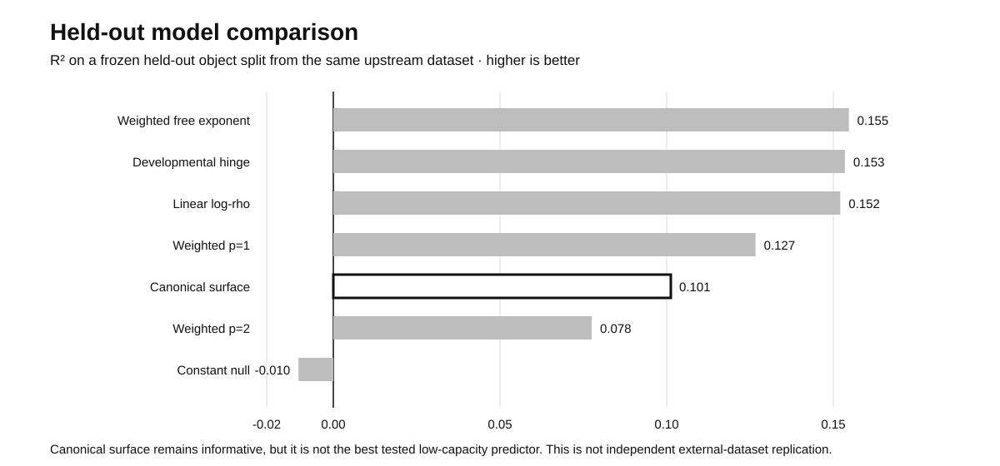

# Mechanism Readability under Observation Interfaces

**A predictive morphological law need not identify its generative mechanism.**

**Hanyu Yu · Independent research · August 2026**

A law can predict what a network looks like without telling us what made it. This project asks a stricter question: **when different candidate generators agree on the low-order behavior we usually measure, what additional observation first makes them distinguishable?**

Here, `rho` is a relative-thickness proxy and `Omega` is a steering readout.

## 30-second result

- **Empirical law.** Three-arm motifs show a robust monotonic thickness-conditioned steering relation on held-out objects from the **same upstream dataset**.
- **Canonical comparison.** The single canonical fixed-boundary surface-minimization curve contains predictive signal, but several frozen low-capacity response laws predict the held-out object split better.
- **Controlled identifiability test.** In a deliberately matched synthetic pair, endpoints and the complete low-order `rho -> Omega` law are identical, yet the generators remain indistinguishable until local path/tangent information is observed with adequate measurement budget.

> **Boundary:** the held-out split is not an independent external-dataset replication. These results do not identify the true generator of empirical networks, do not generally falsify surface optimization, and do not establish a universal minimum observation interface.

## Evidence at a glance

| Question | Frozen evidence | What the evidence supports |
|---|---|---|
| Does a thickness-steering law exist? | Held-out-object hinge `R² = 0.327889`; gain over constant `0.330131`; object-bootstrap gain 95% CI `[0.237221, 0.422327]` | A transportable monotonic relation exists under the frozen motif protocol |
| Is the canonical surface curve uniquely favored? | Official surface `R² = 0.101245`; several frozen low-capacity rivals rank higher; surface still beats the constant null and tested `p=2` law | The canonical fixed-boundary trajectory is informative but not the best tested held-out predictor |
| Can ordinary measurement degradation explain the shallow empirical response? | Moderate compression/noise does not reach the empirical exponent range; severe degradation does so only while degrading motif identity | Plausible observer degradation is insufficient as a generic rescue explanation |
| Can the full low-order law identify mechanism? | Matched pair max declared low-order difference `0.0`; max J0-J2 accuracy `0.500`; J3/J4 become identifiable with adequate budget | Equality of a low-order law does not imply equality of generator in the declared synthetic pair |

## Controlled matched-mechanism benchmark

This benchmark is a **calibration experiment**, not a claim about the true empirical generator.

**Matched exactly:** junction endpoint, terminal geometry, radii, chord lengths, full-axis pair angles, and the complete `rho -> Omega` endpoint trajectory.

**Allowed to differ:** native path-generating structure.

| Interface | Information available | Result |
|---|---|---|
| J0 | radius multiset | not identifiable |
| J1 | unordered chord lengths + full-axis angles | not identifiable |
| J2 | role-aware `rho`, `Omega`, branch-length contrasts | not identifiable |
| J3 | sampled skeleton shape, curvature, local tangents | identifiable with adequate trajectory / replicate budget |
| J4 | exact full geometry + terminal-boundary metadata | identifiable |

The preregistered identification gate requires mean final-boundary accuracy `>= 0.70` and a 95% boundary-bootstrap lower bound `> 0.55`. See [`protocols/R12CB_PREREGISTRATION_NOTE.md`](protocols/R12CB_PREREGISTRATION_NOTE.md) and [`results/R12CB_PRIMARY_MINIMUM_INTERFACE_TABLE.csv`](results/R12CB_PRIMARY_MINIMUM_INTERFACE_TABLE.csv).

## Why this matters

The project keeps three questions separate:

1. **Response existence** — is there a reproducible low-order relation?
2. **Predictive transport** — does it survive held-out objects and environments?
3. **Mechanism identity** — does that relation uniquely determine the generator?

The first two can hold while the third remains unresolved. Mechanism claims therefore depend on the **observation interface** and on interventions that can separate observationally equivalent generators.

## Supporting evidence

- [`CLAIM_BOUNDARY.md`](CLAIM_BOUNDARY.md) — supported, unsupported, and unresolved statements.
- [`results/R9_CONSERVATIVE_REVIEW.md`](results/R9_CONSERVATIVE_REVIEW.md) — transported triad relation and four-arm negative/inconclusive result.
- [`results/R10B1_CONSERVATIVE_REVIEW.md`](results/R10B1_CONSERVATIVE_REVIEW.md) — frozen canonical-vs-rival comparison.
- [`results/R10C_DECISION.md`](results/R10C_DECISION.md) — observer-degradation audit.
- [`results/frozen_summary.json`](results/frozen_summary.json) — machine-readable headline metrics.
- [`DATA_PROVENANCE.md`](DATA_PROVENANCE.md) — upstream data, paper, and locked solver provenance.

The larger development history and technical notes are intentionally not part of this public exhibit.

## Reproducibility status

This release reproduces the **public summary checks and matched-interface evidence table**, not every upstream experiment from raw data. The full historical pipeline depends on upstream Physical Network data, source-locked official-solver exports, and large intermediate packages that are not redistributed here. See [`REPRODUCIBILITY.md`](REPRODUCIBILITY.md).

Every push and pull request runs the lightweight artifact validator in GitHub Actions.

## Data and upstream solver

Empirical network data originate from the Physical Network dataset (Zenodo record `17154400`, DOI `10.5281/zenodo.17154400`). The canonical comparison uses the public `Barabasi-Lab/min-surf-netw` solver locked at commit:

`dcd0ca4490540af8b5e374550f2380055a613955`

The numerical trajectory was extracted from source-verified saved solver states rather than digitized from a paper figure. Upstream assets retain their original terms.

## Open questions

The present evidence does **not** resolve the exact noncanonical surface boundary family `Omega(rho, B)`, the physical skeleton-radius to model-circumference mapping, temporal ordering of geometric changes, a real thickness intervention followed by axis rearrangement, or dynamic matched rivals sharing the same complete final geometry.

## Citation and license

See [`CITATION.cff`](CITATION.cff). No repository-wide open-source license has yet been selected; see [`LICENSE_DECISION.md`](LICENSE_DECISION.md).
