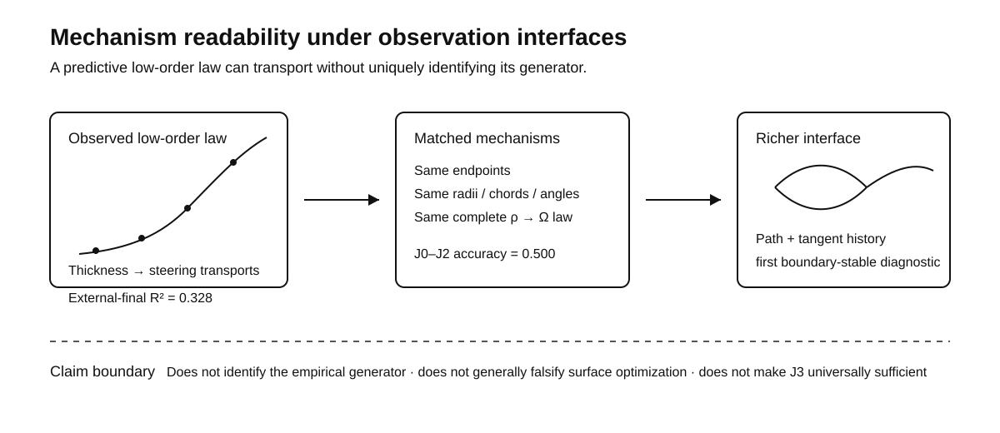

# Mechanism Readability under Observation Interfaces

**A predictive morphological law need not identify its generative mechanism.**

This research artifact asks a stricter question than whether a low-order geometric law predicts: **if two candidate generators agree on the usual observable law, what additional observation first makes them distinguishable?**

## 30-second result

Three-arm motifs show a transportable monotonic thickness-conditioned steering relation across held-out objects. But the single canonical fixed-boundary surface-minimization trajectory is **not uniquely preferred** among the tested low-capacity response laws, and ordinary skeleton compression or plausible low/moderate measurement noise does not explain the shallower empirical response. In a deliberately matched synthetic pair, two generators share endpoints, radii, chord lengths, full-axis angles, and the complete low-order `rho -> Omega` trajectory while remaining indistinguishable at J0–J2; local path shape and tangent history are the first boundary-stable diagnostic channels under the declared measurement budget.

> **Claim boundary:** this does not identify the true generator of empirical networks, does not generally falsify surface optimization, and does not establish a universal minimum observation interface.

## Evidence at a glance

| Question | Frozen evidence | Licensed conclusion |
|---|---|---|
| Does a thickness–steering law exist? | External-final hinge `R² = 0.327889`; gain over constant `0.330131`; object-bootstrap gain 95% CI `[0.237221, 0.422327]` | A transportable monotonic relation exists at the motif level |
| Is the canonical surface curve uniquely favored? | Official surface `R² = 0.101245`; several frozen low-capacity rivals rank higher; surface still beats the constant null and tested `p=2` law | The single canonical trajectory is predictive but not uniquely preferred |
| Can ordinary measurement degradation explain the shallow empirical response? | Moderate compression/noise does not reach the empirical exponent range; severe degradation does so only while destroying motif identity | Plausible observer degradation is insufficient as a generic rescue explanation |
| Can the full low-order law identify mechanism? | Matched pair max declared low-order difference `0.0`; max J0–J2 accuracy `0.500`; J3/J4 become identifiable with adequate budget | Equality of a low-order law does not imply equality of generator |

## Matched-mechanism benchmark

The benchmark deliberately removes the obvious shortcuts.

**Matched exactly:** junction endpoint, terminal geometry, radii, chord lengths, full-axis pair angles, and the complete `rho -> Omega` endpoint trajectory.

**Allowed to differ:** native path-generating structure.

| Interface | Information available | Result |
|---|---|---|
| J0 | radius multiset | not identifiable |
| J1 | unordered chord lengths + full-axis angles | not identifiable |
| J2 | role-aware `rho`, `Omega`, branch-length contrasts | not identifiable |
| J3 | sampled skeleton shape, curvature, local tangents | identifiable with adequate trajectory / replicate budget |
| J4 | exact full geometry + terminal-boundary metadata | identifiable |

The preregistered identification gate requires mean final-boundary accuracy `>= 0.70` and a 95% boundary-bootstrap lower bound `> 0.55`. See [`protocols/R12CB_PREREGISTRATION_NOTE.md`](protocols/R12CB_PREREGISTRATION_NOTE.md) and [`results/R12CB_PRIMARY_MINIMUM_INTERFACE_TABLE.csv`](results/R12CB_PRIMARY_MINIMUM_INTERFACE_TABLE.csv).

## What this changes conceptually

The project keeps three questions separate:

1. **Response existence** — is there a reproducible low-order relation?
2. **Predictive transport** — does it survive held-out objects and environments?
3. **Mechanism identity** — does that relation uniquely determine the generator?

The first two can hold while the third fails. Mechanism claims therefore depend on the **observation interface** and on the interventions available to separate observationally equivalent generators.

## Audit trail

This repository is intentionally a curated scientific exhibit rather than a dump of the development history.

- [`CLAIM_BOUNDARY.md`](CLAIM_BOUNDARY.md) — supported, unsupported, and unresolved statements.
- [`results/R9_CONSERVATIVE_REVIEW.md`](results/R9_CONSERVATIVE_REVIEW.md) — transportable triad relation and four-arm null boundary.
- [`results/R10B1_CONSERVATIVE_REVIEW.md`](results/R10B1_CONSERVATIVE_REVIEW.md) — frozen canonical-vs-rival comparison.
- [`results/R10C_DECISION.md`](results/R10C_DECISION.md) — observer-degradation audit.
- [`results/frozen_summary.json`](results/frozen_summary.json) — machine-readable headline metrics.
- [`DATA_PROVENANCE.md`](DATA_PROVENANCE.md) — upstream data and solver provenance.

The larger development bundle, original runners, and technical notes are intentionally not placed in the public root. They remain part of the private audit archive until a redistribution and source-lock review is complete.

## Reproducibility status

This release validates the **public evidence ledger and matched-interface summary**; it is not yet a turnkey clean-room reproduction of every upstream phase. Upstream physical-network data and the public `min-surf-netw` solver are not redistributed here by default. See [`REPRODUCIBILITY.md`](REPRODUCIBILITY.md).

## Data and upstream solver

Empirical network data originate from the Physical Network dataset (Zenodo record `17154400`, DOI `10.5281/zenodo.17154400`). The canonical comparison uses the public `Barabasi-Lab/min-surf-netw` solver and source-verified saved states. Upstream assets retain their original terms.

## Open cells

The present evidence does **not** resolve the exact noncanonical surface boundary family `Omega(rho, B)`, the physical skeleton-radius to model-circumference mapping, temporal ordering of geometric changes, a real thickness intervention followed by axis rearrangement, or dynamic matched rivals sharing the same complete final geometry.

## Citation and license

See [`CITATION.cff`](CITATION.cff). No repository-wide open-source license has yet been selected; see [`LICENSE_DECISION.md`](LICENSE_DECISION.md).
